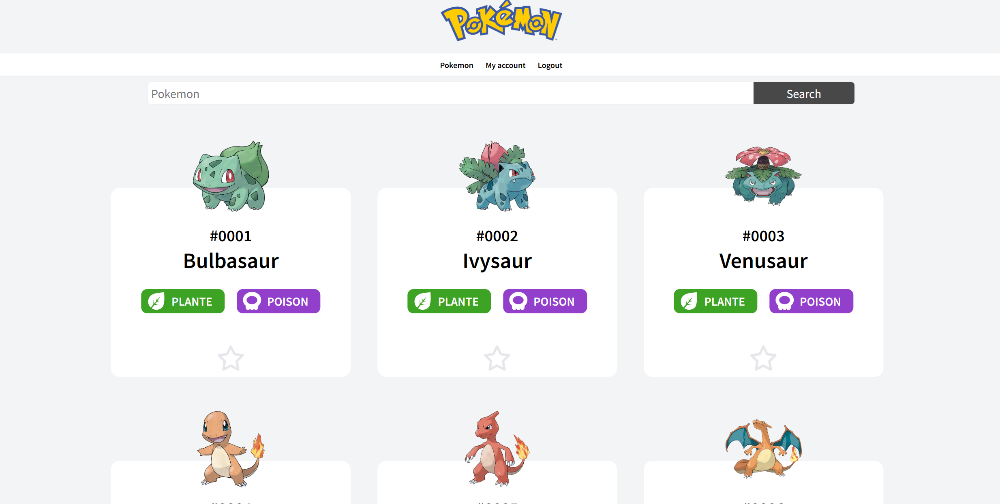

# Pokedex

Develop a Pokedex application using PHP procedural programming. The application should have an index.php page displaying a list of Pokemon. Users should be able to click on a Pokemon to view its details and evolution. Additionally, implement an user authentication system with a login and registration page, allowing users to save their favorite Pokemon.

This project was made in november 2023 during a formation at BeCode. 

## Screenshots

## Badges

## Authors

- [@Carole](https://github.com/Carole-GRD)
- [@Rosalie](https://github.com/RosaBld)
- [@Tim](https://github.com/TimDesmet00)
- And me